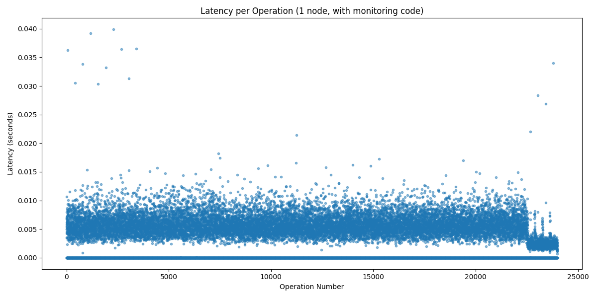
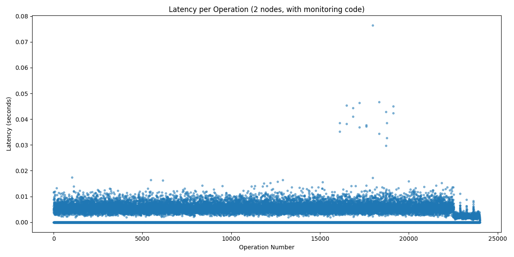
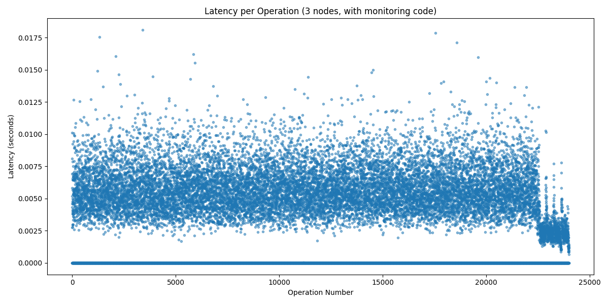

# OTKV: Our KV-Architecture

## Thomas Knickerbocker, Owen Ratgen

## 1. Implementation Process

Our key-value store was first implemented in python and later converted into Rust. 
<br>
The python implementation uses flask with fastwsgi (which we found to be faster than fastAPI) as its web gateway and either a trie or dragonflydb (which can be seen as an improvement upon redis) as its kv_store, depending on the user's configurations. 
Our store logs every operation along with its timestamp in the logs folder, in addition to periodically logging entirety of the kv_store elsewhere. 
<br>
Our Rust implementation leverages the actix webserver with a basic hashmap and a shared-state lock-protected dashmap to represent the state.
<br>
Benchmark.py functions both as a benchmark and as a routing server for incoming requests. It utilizes a consistent and fast hashing algorithm based on the key of the request to determine which node within the hashring to forward that request to, and sends out requests in batches of threads that are monitored and reported upon during operation. 


## 2. Benchmarking Statistics (Rust)
**Ran on one 2024 M3 Macbook Air, 16Gigs RAM**

**Settings Used:**
- NUM_THREADS = 10
- OPS_PER_THREAD = 800
- PRINT_INTERVAL = 1

<br>
1 KV-Store Final Results:
Total operations: 24000
Total time: 9.56 seconds
Throughput: 2511.24 operations per second
Average Latency: 0.00185 seconds per operation


2 KV-Stores Final Results:
Total operations: 24000
Total time: 9.51 seconds
Throughput: 2523.65 operations per second
Average Latency: 0.00172 seconds per operation


3 KV-Stores Final Results:
Total operations: 24000
Total time: 9.35 seconds
Throughput: 2567.69 operations per second
Average Latency: 0.00177 seconds per operation



From the previous statistics and graphs, it is quite obvious that the more servers we have for consistent hashing, the lower the overall and average latency will be but the higher the overall throughput will be. There are tradeoffs to the two but I would take performance over number of operations in a heart beat.


## Running (Rust)

1. Go into directory kv_store, download rust if you haven't already here https://doc.rust-lang.org/cargo/getting-started/installation.html#:~:text=Install%20Rust%20and%20Cargo&text=Installing%20Rust%20using%20rustup%20will%20also%20install%20cargo%20.&text=It%20will%20download%20a%20script%2C%20and%20start%20the%20installation, and python if necessary.
Then in the terminal, run:
```
cargo build --release
cargo run --release
```
3. Go into a new terminal and run:
```
pip3 install -r requirements.txt
python3 benchmark.py
```
from the base directory.
